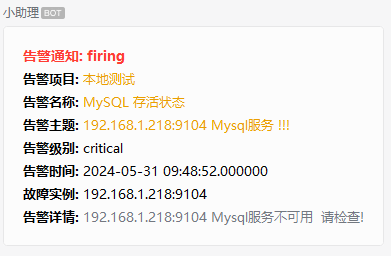
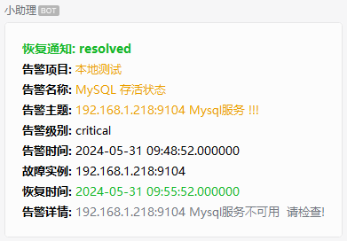

# weixin_robot
alert manager 通过webhook将消息发送到企业微信群。

# alert manager配置
```yaml
route:
  group_by: ['alertname','instance']
  group_wait: 30s
  group_interval: 5m
  repeat_interval: 1h
  receiver: 'team-X-webhook'
receivers:
    - name: 'team-X-webhook'
      webhook_configs:
        - url: 'http://192.168.1.225:6000/alertinfo'
            send_resolved: true
```
# 多架构镜像
```bash
# x86
llody/weixin-robot:v1-amd64

# ARM64
llody/weixin-robot:v1-arm64 

```

# 重复消息合并
> vim app.py
```python

import time

# 存储已处理告警的集合
processed_alerts = set()

# 时间间隔（秒）
alert_window = 120

@app.route('/alertinfo', methods=['POST'])
@as_json
def alert_data():
    data = request.get_data()
    json_re = json.loads(data)  

    # 生成告警的唯一标识符（例如，使用告警内容和时间戳）
    alert_id = hash(json.dumps(json_re)) + int(time.time())

    # 检查告警是否在时间窗口内重复
    if alert_id in processed_alerts:
        return json_re

    # 添加告警到已处理集合，并设置过期时间
    processed_alerts.add(alert_id)
    time.sleep(alert_window)  # 间隔发送时间
    processed_alerts.remove(alert_id)  # 从集合中移除已处理的告警

    # 处理告警
    Alert.send_alert(json_re, args.key)
    return json_re
```
> 上诉方法将相同的消息进行了一个简单抑制，并不是合并，多条重复的消息会存储到集合中，每两分钟发送一条，避免被消息淹没。
> 缺点：如果此类型告警有恢复通知，会被延迟发送，因为要等同类型的消息发送完成才能继续发送，有时间我再研究哈。

# 启动方式

## 源码启动方式
```bash
# 克隆源码库
git clone https://github.com/llody55/weixin_robot.git

# 进入目录
cd  weixin_robot

# 安装依赖
RUN pip install --no-cache-dir -r requirements.txt -i https://pypi.tuna.tsinghua.edu.cn/simple

# 启动
python  app.py --port 6000  --key  https://qyapi.weixin.qq.com/cgi-bin/webhook/send?key=744ad541-e6b1-4a3b-8aeb-4a01457cb646
```
> 替换你自己的webhook地址

## systend启动方式
```bash
# 将systend的service文件拷贝到指定目录下
cp weixin-robot.service /lib/systemd/system/weixin-robot.service
# 重载并启动
systemctl daemon-reload
systemctl start weixin-robot.service
systemctl enable weixin-robot.service
```
> 注意：拷贝之前请先修改weixin-robot.service中Python的版本，app.py的绝对路径和KEY的值。

## docker启动方式
```bash
docker run \
    -e PORT=6000 \
    -e KEY=https://qyapi.weixin.qq.com/cgi-bin/webhook/send?key=744ad541-e6b1-4a3b-8aeb-4a01447cb646  \
    -itd \
    --name weixin-robot \
    --restart=always \
    -p 6000:6000  \
    llody/weixin-robot:v1-amd64
```
> 别忘了修改KEY的值。

## docker-compose启动
```bash
docker-compose -f yaml/docker-compose.yml up -d
```
> 别忘了修改KEY的值。

## K8S启动方式
```bash
kubectl apply -f yaml/weixin-robot.yaml
```
> 别忘了修改KEY的值。


# 告警实例
## 告警通知


## 恢复通知



# 参考项目
> 本项目来源[hsggj002](https://github.com/hsggj002/prometheus-flask),感谢道友提供思路。


